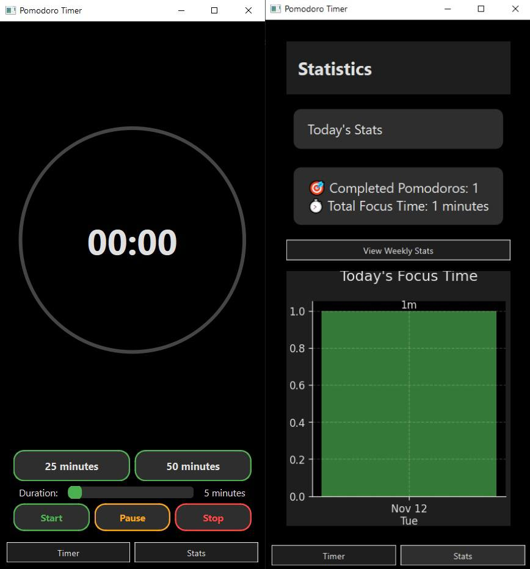

# Pomodoro Timer (Python Version)
A fully functional Python-based Pomodoro Timer I'm using while taking my time to learn Next.js properly. This app implements a progressive Pomodoro approach - rather than strict 25-minute sessions, it adapts to your flow state and work rhythm.

## Project Context 🎯
This is my working Pomodoro timer that I'll be using while learning Next.js at my own pace. Rather than rushing to build a web version without proper knowledge, I've created this Python app to:
- Have a functional timer that adapts to my workflow
- Track my focus sessions and progress
- Serve my needs while I take time to properly learn Next.js

<p align="center">
  
</p>

## Features
- 🎯 Customizable timer duration (1-120 minutes)
- ⚡ Quick preset buttons (25 and 50 minutes)
- 🌙 Dark mode interface
- 📈 Visual progress tracking
- 🌊 Flexible sessions that adapt to your flow state
- 🔇 No notifications so far but it pops above the window you are currently using

## Requirements
- Python 3.x
- PyQt6
- matplotlib
- win32gui (Windows only)

## Installation
1. Clone the repository
2. Install dependencies:
```sh
pip install PyQt6 matplotlib pywin32
```

## Usage
Run the application:
```sh
python main.py
```
- Use preset buttons or slider to set timer duration
- Click Start to begin a focus session
- View your progress in the Stats tab
- Check detailed session history with view_db.py

## Database
Session data is stored in pomodoro.db using SQLite. View session history:
```sh
python view_db.py
```